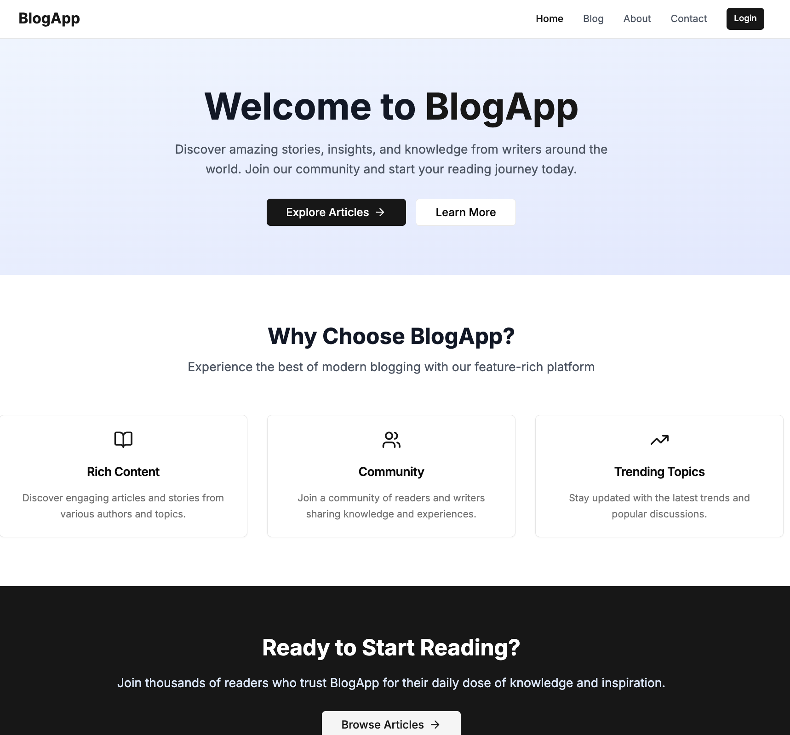
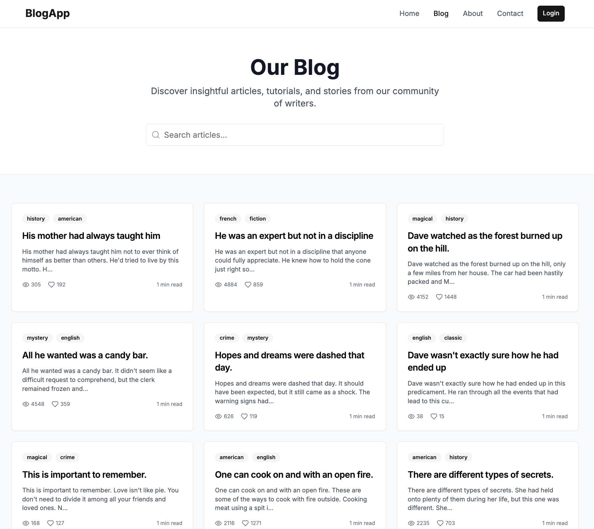
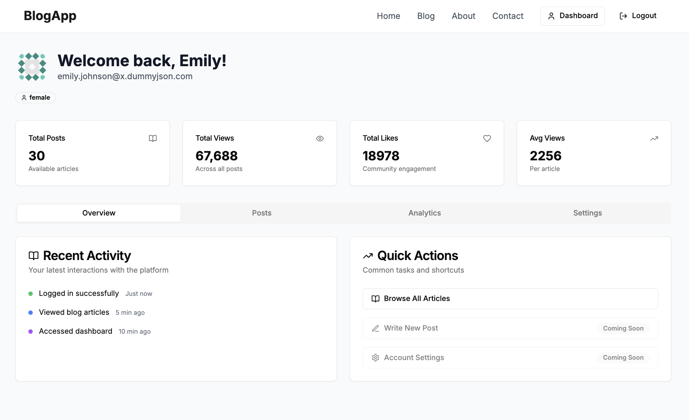

# 🚀 BlogApp - Next.js + Redux-Saga


> A **full-featured blog application** showcasing modern **Next.js App Router**, **Redux Toolkit + Redux-Saga**, **authentication**, **SSR/SSG**, and **responsive design**.  
> Built as an **internship assignment** and polished for my **portfolio**.

---

## ✨ Features

- 📰 **Modern Blog Interface** – Clean, responsive, mobile-first UI  
- 🔐 **Authentication System** – Login/logout with DummyJSON API  
- 🛡 **Protected Routes** – Dashboard for authenticated users only  
- ⚡ **State Management** – Redux Toolkit + Redux-Saga for async flows  
- 🌐 **Server-Side Rendering (SSR) + SSG** – SEO & performance optimized  
- 🛠 **Custom API Routes** – Extendable Next.js API layer  
- 🎨 **Responsive Design** – Tailwind CSS + shadcn/ui components  
- 📱 **Cross-Device Ready** – Works on mobile, tablet, and desktop  

---

## 🖼 Preview

### 🔹 Home Page


### 🔹 Blog Listing with Search


### 🔹 Protected Dashboard


👉 **Live Demo**: [https://nishant-blog.vercel.app](https://nishant-blog.vercel.app)

---

## 🛠 Tech Stack

- **Framework**: [Next.js 13+ App Router](https://nextjs.org/)  
- **State Management**: [Redux Toolkit](https://redux-toolkit.js.org/) + [Redux-Saga](https://redux-saga.js.org/)  
- **Styling**: [Tailwind CSS](https://tailwindcss.com/) + [shadcn/ui](https://ui.shadcn.com/)  
- **Language**: [TypeScript](https://www.typescriptlang.org/)  
- **API**: [DummyJSON](https://dummyjson.com/) for demo data  
- **Icons**: [Lucide React](https://lucide.dev/)  

---

## 📂 Project Structure

```bash
├── app/                    # Next.js app router
│   ├── api/                # API routes
│   ├── blog/               # Blog pages
│   ├── dashboard/          # Protected dashboard
│   └── login/              # Auth pages
├── components/             # UI & feature components
│   ├── ui/                 # shadcn/ui primitives
│   ├── HOC/                # Higher-order components
│   └── Card/               # Post cards etc.
├── store/                  # Redux store setup
│   ├── slices/             # RTK slices
│   └── sagas/              # Saga workers/watchers
├── services/               # API service layers
├── hooks/                  # Custom React hooks
├── types/                  # TypeScript definitions
└── utils/                  # Utility helpers
```

---

## ⚡ Getting Started

1. **Clone & install dependencies**
   ```bash
   git clone https://github.com/yourusername/blog-app.git
   cd blog-app
   npm install
   ```
2.	Run development server
    ```bash
    npm run dev
    ```
3.	Demo login credentials
  	```bash
    Username: emilys
    Password: emilyspass
    ```


🔑 Key Implementation Details

Redux + Saga
	•	Configured with Redux Toolkit for slices
	•	Saga middleware for async flows & side effects
	•	Separation of slices and sagas for clean structure

Authentication Flow
	•	Login form with validation & error handling
	•	Token persisted in localStorage
	•	Protected routes via HOC
	•	Auto session validation on refresh

Data Fetching
	•	All async handled via Saga workers
	•	Loading & error states handled in Redux
	•	Optimistic updates & proper cleanup

UI/UX
	•	Tailwind CSS + shadcn/ui components
	•	Mobile-first responsive design
	•	Smooth animations & hover states

⸻

📊 Core Pages
	•	🏠 Home – Highlights app features
	•	📰 Blog – Post listing with search
	•	📝 Blog Detail – Individual post view
	•	📊 Dashboard – Auth-protected user area
	•	🔑 Login – Auth with demo credentials
	•	📖 About / Contact – Extra pages

⸻

🔒 Security
	•	✅ Authenticated route protection
	•	✅ Token validation & persistence
	•	✅ Error boundaries for runtime safety
	•	✅ Proxying API routes securely

⸻

🎨 Design System
	•	Primary Color: #3B82F6 (blue)
	•	Font: Inter
	•	Spacing: 8px unit system
	•	Components: shadcn/ui
	•	Icons: Lucide React

⸻

📱 Responsive Breakpoints
	•	Mobile: <768px
	•	Tablet: 768px–1024px
	•	Desktop: >1024px

⸻

📝 License

This project is licensed under the MIT License – feel free to use, learn, and build upon it.

⸻

🙌 Acknowledgements
	•	Next.js
	•	Redux Toolkit
	•	Redux Saga
	•	Tailwind CSS
	•	shadcn/ui
	•	DummyJSON

⸻

⭐ If you like this project, consider giving it a star on GitHub — it motivates me to build more!
